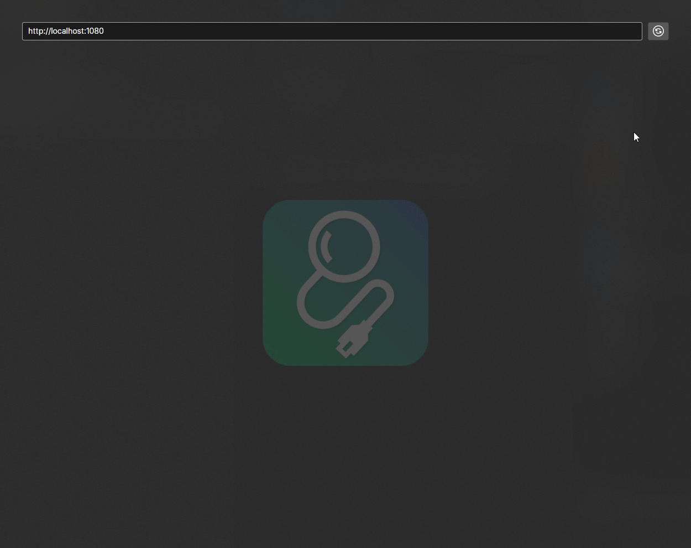

# WireMockInspector

WireMockInspect is a cross platform UI app that facilitates [WireMock](https://wiremock.org/) troubleshooting.


## How to install

WireMockInspector is distributed as `dotnet tool` so it can be easily install on `Windows/MacOS/Linux` with the following command

```
dotnet tool install --global WireMockAdminUI --no-cache --ignore-failed-sources
```

After installation you can easily run the app by executing `wiremockinspector` command.

## Features
- Presents a list of requests received by `WireMock` server.
- Combines request data with associated mapping.

