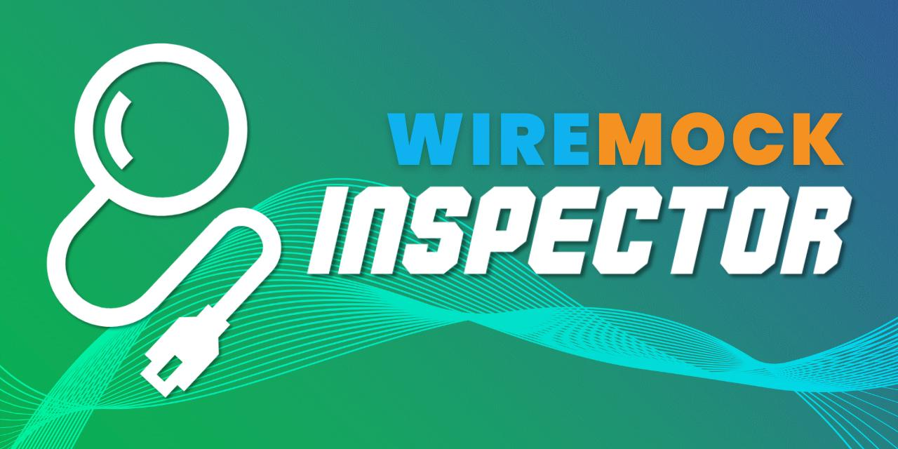
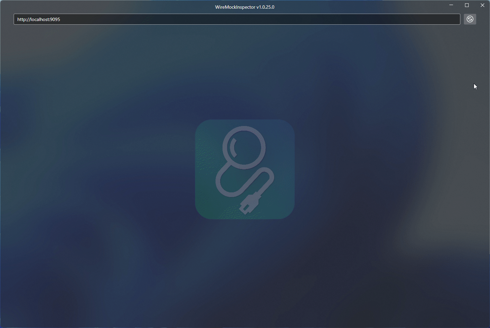
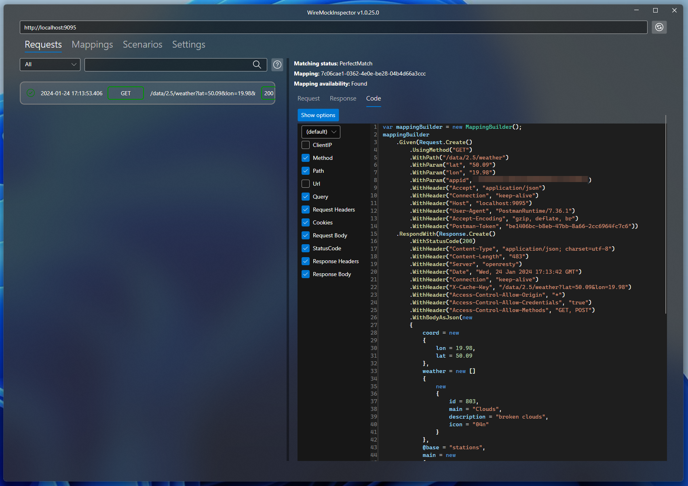

# WireMockInspector

WireMockInspect is a cross-platform UI app that facilitates [WireMock](https://wiremock.org/) troubleshooting.



## How to install

WireMockInspector is distributed as `dotnet tool` so it can be easily installed on `Windows/MacOS/Linux` with the following command

```
dotnet tool install WireMockInspector --global --no-cache --ignore-failed-sources --add-source https://api.nuget.org/v3/index.json
```

After installation, you can easily run the app by executing `wiremockinspector` command.

## How to update

```
dotnet tool update WireMockInspector --global --no-cache --ignore-failed-sources --add-source https://api.nuget.org/v3/index.json
```

## Features
- Presents a list of requests received by `WireMock` server.
- Combines request data with associated mapping.
- Presents a list of all available mappings with the definition
- Generate C# code for defining selected mappings
- WireMockServer settings editor
- Presents a list of all available scenarios along the details
- Visualise Scenario flow and current state


## Using WireMockInspector from test code

1. Install [WireMockInspector](https://github.com/WireMock-Net/WireMockInspector) dotnet tool

	```shell
	dotnet tool install WireMockInspector --global --no-cache --ignore-failed-sources
	```

2. Install `WireMock.Net.Extensions.WireMockInspector` nuget packet to your test project
3. Example usage in the code

	```cs
	using var wireMock = WireMockServer.Start(new WireMockServerSettings()
						{
							StartAdminInterface = true,
							Port = 9095
						});

	// Call Inspect() run WireMockInspect and attach it to the current WireMockServer instance
	wireMock.Inspect();
	```
	If you don't have an access to WireMockServer instance then you can call the extension method directly:
	```cs
	WireMockServerExtensions.Inspect("http://localhost:9095");
	```


## Code generator

WireMockInspect offers two methods for generating C# code to create mappings, which is particularly useful when used in conjunction with the [WireMock.NET proxy](https://github.com/WireMock-Net/WireMock.Net/wiki/Proxying) feature. The first method is accessible via the 'Code' tab for a selected mapping. Here, you can view the code provided by the endpoint http://localhost:9095/__admin/mappings/code/MAPPING_GUID:



The second method involves using the 'Code' tab for a selected request.



This approach employs a completely different mechanism for code generation. You can customize the generated code by using a custom liquid template:

1) Download the [default template](https://github.com/WireMock-Net/WireMockInspector/blob/main/src/WireMockInspector/CodeGenerators/default_template.liquid) and save it to your directory at `%LOCALAPPDATA%\WireMockInspector\templates\` .
2) Rename the file appropiately to reflect its purpose
3) Modify the template according to your requirements.
3) In the WireMockInspector, under the 'Show Options' section on the 'Code' tab, select your customized template from combo box.
